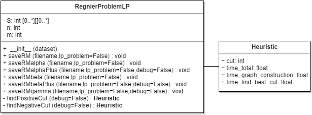

# Introduction

The repository contains the codes implemented for the article "Preprocessing Techniques for Qualitative data Clustering via Integer Linear Programming".

Two [Python 3.4](https://www.python.org/download/releases/3.4.0/) classes were implemented:

- RegnierProblem: contains methods to create all the Integer Linear Programming models proposed in the article and run it in the CPLEX solver. This class only works if [CPLEX solver](https://www-01.ibm.com/software/commerce/optimization/cplex-optimizer/) is installed in the machine!
- RegnierProblemLP: contains methods to create the models and save then in [LP file format (.lp)](http://lpsolve.sourceforge.net/5.0/CPLEX-format.htm). This class is independent of the [CPLEX solver](https://www-01.ibm.com/software/commerce/optimization/cplex-optimizer/)!

# Install

To run both classes you will need to install [Python 3.4](https://www.python.org/download/releases/3.4.0/) and the [Igraph library] (http://igraph.org/python/). The RegnierProblem class requires the installation of the [CPLEX 12.6.0] (http://www-01.ibm.com/software/commerce/optimization/
cplex-optimizer) solver and the [setup of its Python API](https://www.ibm.com/support/knowledgecenter/SSSA5P_12.6.3/ilog.odms.cplex.help/CPLEX/GettingStarted/topics/set_up/Python_setup.html).

# Usage

### RegnierProblem

The following diagram represents the RegnierProblem class. The documentation for this class can be found at: [RegnierProblem.html](docs/RegnierProblem.html)

Example of use:

    >>> from RegnierProblem import RegnierProblem
    >>> problem = RegnierProblem("datasets/1-Lenses.txt")
    >>> solution = problem.runRMalphaPlus()
    >>> print(solution)
    {'num_rows': 2400,
     'num_cols': 276,
     'objective': 72.0,
     'time_solver': 0.18799999999999994,
     'groups': [0, 1, 0, 1, 2, 2, 3, 3, 0, 1, 0, 1, 2, 2, 3, 3, 0, 1, 0, 1, 2, 2, 3, 3]
     'heuristic': {'cut': 2,
                   'time_total': 0.008021116256713867, 
                   'time_graph_construction': 0.00701904296875, 
                   'time_find_best_cut': 0.0010020732879638672}}

### RegnierProblemLP

The following diagram represents the RegnierProblemLP class. The documentation for this class can be found at:

Example of use:

    >>> from RegnierProblemLP import RegnierProblemLP
    >>> problem = RegnierProblemLP("datasets/1-Lenses.txt")
    >>> problem.saveRMalphaPlus("1-Lenses.lp")
    Creating Model file...
    Model file created.
